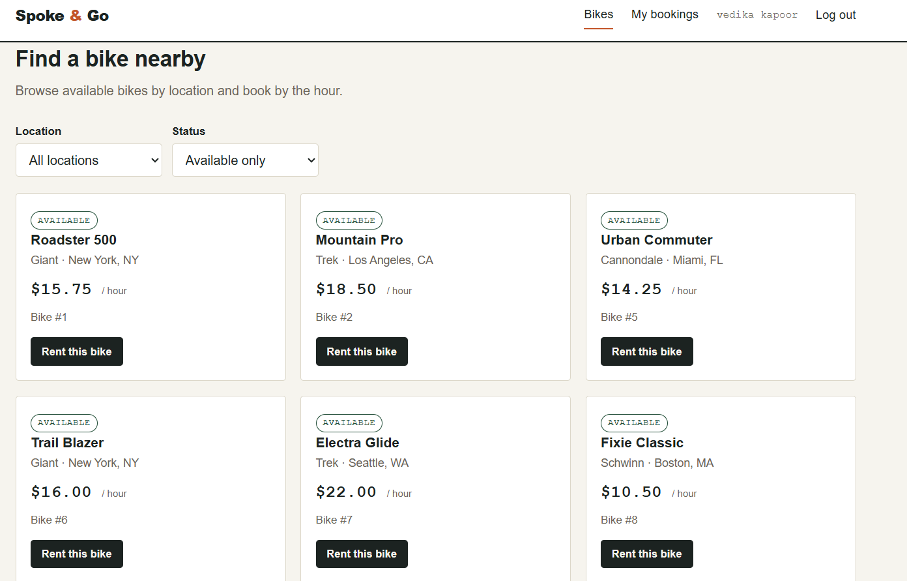
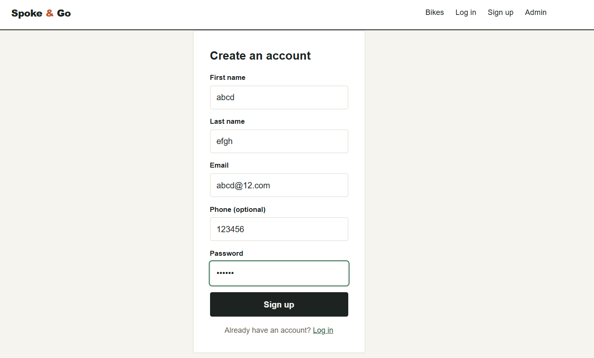
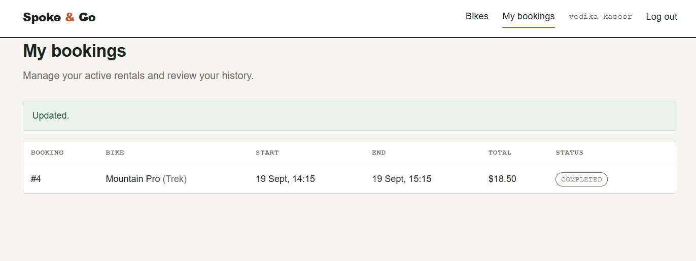
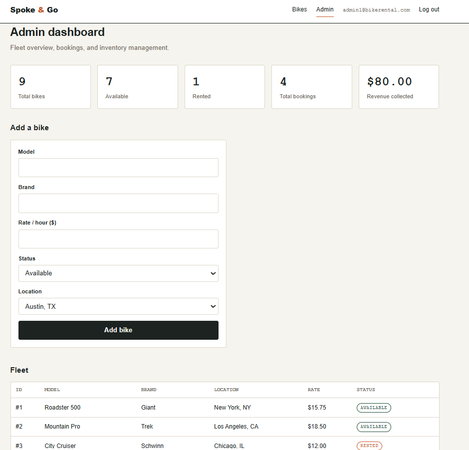

# Bike Rental System

A full-stack bike rental app: MySQL database (tables, triggers, stored procedures) + a Node.js/Express REST API + a plain HTML/CSS/JS frontend.

This started as a DBMS coursework project (see `docs/DBMS_project_report.docx` and `docs/ER Diagram.jpg`) and has since grown into a full-stack implementation.

```
bike-rental-system/
├── database/
│   ├── 01_schema.sql       # tables
│   ├── 02_procedures.sql   # stored procedures + triggers
│   └── 03_seed.sql         # sample data (bcrypt-hashed passwords)
├── backend/                # Express REST API
│   ├── server.js
│   ├── db.js
│   ├── routes/
│   └── .env.example
└── frontend/                # static HTML/CSS/JS site
    ├── index.html            (browse & book bikes)
    ├── login.html / register.html  (signup redirects to login, no auto-login)
    ├── my-bookings.html      (rider dashboard)
    ├── admin.html            (admin dashboard)
    ├── css/style.css
    └── js/
```

## 1. Set up the database (MySQL Workbench / XAMPP)

Open MySQL Workbench (or the `mysql` CLI) connected to your local server and run the three files **in order**:

```sql
SOURCE /path/to/bike-rental-system/database/01_schema.sql;
SOURCE /path/to/bike-rental-system/database/02_procedures.sql;
SOURCE /path/to/bike-rental-system/database/03_seed.sql;
```

(In Workbench you can also just open each file and click the ⚡ "Execute" button, in that order.)

This creates a `bike_rental` database with 9 tables, 4 triggers, and 5 stored procedures (`AddBike`, `BookBike`, `CancelBooking`, `UndoCancelBooking`, `ReturnBike`, plus the read procedures `GetAvailableBikesByLocation` / `GetUserBookingHistory`).

**Demo logins** (seeded in `03_seed.sql`):
- Riders: any email like `john.doe@example.com` … `jennifer.t@example.com`, password `password123`
- Admins: `admin1@bikerental.com` … `admin5@bikerental.com`, password `admin123`

## 2. Run the backend

```bash
cd backend
npm install
cp .env.example .env
```

Edit `.env` with your MySQL credentials:

```
PORT=4000
DB_HOST=localhost
DB_PORT=3306
DB_USER=root
DB_PASSWORD=your_mysql_password
DB_NAME=bike_rental
```

Then start the API:

```bash
npm start
```

You should see `Bike Rental API listening on http://localhost:4000`. Check it's alive: open `http://localhost:4000/api/health` in a browser — you should see `{"ok":true}`.

## 3. Run the frontend

The frontend is plain static HTML/CSS/JS, so no build step is needed — just serve the `frontend/` folder so the browser fetches pages over `http://` (opening `index.html` directly via `file://` will still work for the UI, but some browsers restrict `fetch` from `file://`, so a static server is safer).

Easiest options:
- **VS Code**: install the "Live Server" extension, right-click `frontend/index.html` → "Open with Live Server".
- **Node**: `npx serve frontend` (from the project root) then open the printed URL.
- **Python**: `cd frontend && python3 -m http.server 5500` then open `http://localhost:5500`.

The frontend calls the API at `http://localhost:4000/api` — that's hardcoded in `frontend/js/api.js` (`API_BASE`). Change it there if you run the backend on a different port or host.

## Screenshots

### Bike browsing


### Sign up


### My bookings


### Admin dashboard


## What each part covers

- **Riders**: sign up (creates the account but does not log you in), then log in with that email/password, browse bikes by location/status, book a bike for a time window (cost is computed server-side via the `BookBike` procedure), view booking history, cancel/undo-cancel/return a rental.
- **Admins**: log in separately, see fleet + booking + revenue stats, add new bikes, view the full fleet and all bookings.
- **Business rules enforced at the database layer** (triggers): a bike can't be double-booked for an overlapping time window, and a rider can't hold two overlapping bookings at once — both checked in a `BEFORE INSERT` trigger regardless of how a row gets inserted, not just through the API.

## Notes / next steps if you extend this

- Auth here is intentionally simple (no JWT/sessions) — login just returns the user/admin row and the frontend keeps it in `localStorage`. Fine for a school/demo project; swap in real sessions or JWT before deploying anywhere public.
- The `Manages` join table (Admin ⟷ Booking, for audit trails) exists in the schema but isn't wired into the API yet — a natural next endpoint would be `POST /api/admin/manages` to log which admin touched which booking.
- CORS is wide open (`cors()` with no options) since this is local-only; restrict `origin` before deploying.
